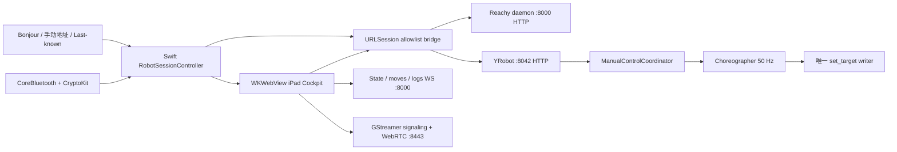

# YRobot iPad Cockpit Implementation Plan

> **For Claude:** REQUIRED SUB-SKILL: Use `executing-plans` to implement this plan task-by-task. Do not edit production robot files directly.

**Goal:** 在 iPadOS 上交付一个可自用真机安装并可经 TestFlight 分发的 YRobot Remote：以现有 `desktop-app` 可见功能为基线，通过 SwiftUI 原生外壳承载 React/Three.js/WebRTC cockpit，并安全实现发现、BLE 配网、机器人状态、相机、动作、语音设置和手动控制。

**Architecture:** SwiftUI 负责权限、Bonjour、BLE/CryptoKit、机器人会话、REST allowlist bridge、前后台生命周期和签名；WKWebView 内的 iPad 专用 React 入口负责 cockpit、Three.js 3D、状态/日志 WebSocket 与 GStreamer WebRTC。HTTP 不从 WKWebView 直接访问机器人；Controller 不再直写 daemon 8000，而经 YRobot 8042 的短租约 manual-control API 进入 Choreographer，确保 Choreographer 始终是唯一 `set_target` 写者。

**Tech Stack:** Swift 6.3、SwiftUI、WebKit、Network.framework、CoreBluetooth、CryptoKit、GameController、URLSession、XCTest、XcodeGen；React 19、TypeScript、Vite、MUI、Zustand、Three.js、React Three Fiber、Vitest；Python 3、FastAPI、pytest。

---

## 0. 执行上下文与不可变边界

### 0.1 固定基线

- 唯一代码真相源：`/Users/leenzhou/Projects/YRobot-reachy-current`
- 父仓库调研时基线：`codex/xz-uplink-vad-v2@b8e35d804c3b`
- 用户指定的 desktop 功能基线：
  - 路径：`/Users/leenzhou/Projects/YRobot-reachy-current/desktop-app`
  - 分支：`yrobot/custom`
  - 提交：`9d441599e556`
- 调研时工作区仅有既存的 `?? .worktrees/`；开始实施前必须重新核对，不得覆盖并行工作的变更。
- 开发机已验证：Xcode 26.5、Swift 6.3.2、XcodeGen 2.45.4、Node 26.3.1、npm 11.16.0。
- iPad target 最低版本：iPadOS 17.0；主要布局为横屏，竖屏和 Split View 必须可用。

### 0.2 开工方式

所有实现必须放在父仓库的隔离 worktree，不在当前主工作树或机器人上直接改：

```bash
cd /Users/leenzhou/Projects/YRobot-reachy-current
git status --short --branch
git worktree add .worktrees/ipad-cockpit -b feature/ipad-cockpit HEAD
cd .worktrees/ipad-cockpit
cat AGENTS.md
cat AGENT_HANDOFF.md
```

如果 `feature/ipad-cockpit` 或该 worktree 已存在，先停下并检查，不得强删。执行期间以：

```text
/Users/leenzhou/Projects/YRobot-reachy-current/.worktrees/ipad-cockpit
```

为下文所有相对路径的根目录。

### 0.3 硬约束

1. 不修改官方 Reachy daemon 的行为或文件；机器人侧新接口只加入 YRobot 8042。
2. 不在 iPad、Web bundle、日志、Git 或 Dashboard 中读取、展示、缓存 HA token、DashScope key 或 `environment_overrides`。
3. 后端切换继续执行“保存配置 → 显示 restart required → 用户显式确认重启”；不得热切换。
4. QWEN 失败必须保持可见；不得静默切回 XIAOZHI。
5. 相机必须是 video-only：最终 SDP 中不得存在 `m=audio`，否则禁止发布。
6. Controller 与 Expressions 不得再直接调用 8000 的 `set_target` 或 recorded-move 执行接口。
7. 物理动作、相机不抢扬声器、前后台失联释放手控等结论必须由 operator 在机器人旁确认。
8. 部署机器人侧 YRobot 变更只能使用 `scripts/deploy.sh`；部署前先 `--dry-run`，不得 ad-hoc `scp`。
9. 本计划中的里程碑提交可用于本地检查；推送前按项目约定 squash 为一个提交，并保留唯一 `Made-with: Proma` trailer。

---

## 1. 功能等价边界

这里的“相同功能”定义为**用户可见意图等价且在当前机器人上真实可用**，不是复制 desktop 的 Tauri 实现、死代码或已知危险路径。

| Desktop 可见能力 | iPad 交付 | 迁移方式 |
| --- | --- | --- |
| Bonjour/静态域名发现、手动 IP | 是 | `NWBrowser` + probe + last-known + 手动地址 |
| 首次 Wi-Fi 设置 | 是 | 原生 BLE + CryptoKit sealed PSK；不要求用户加入热点 |
| Bluetooth troubleshooting | 部分等价 | PING、网络状态、扫描、连接、忘记网络；不复制当前协议不再支持的 restart/reset/journal 残留 |
| 3D 数字孪生 | 是 | 复用 URDF/STL/WASM/Three.js 和 20 Hz 状态流 |
| 3D/摄像头交换 | 是 | 复用 Web UI，触屏始终显示交换按钮 |
| 摄像头 | 是 | 用户主动开启；GStreamer WebRTC video-only |
| DoA 指示 | 是 | 来自 8000 state WS，不依赖 WebRTC 音频 |
| 麦克风波形 | 否 | 当前 camera path 已删除音频轨，原 UI 数据源失效；不得伪装有波形 |
| 扬声器/麦克风音量 | 是 | 原生 HTTP bridge 映射既有 API |
| daemon 日志、紧凑/全屏 | 是 | JS 直连固定 logs WS；默认收起，支持复制经过脱敏的日志 |
| Expressions、舞蹈 | 是 | UI 复用；执行统一改为 8042 `/api/motion` |
| Controller（触控 + Gamepad） | 是 | UI 复用；触控保持 Web，实现原生 `GCController` 事件桥；执行改为 8042 manual lease，Choreographer 仍是唯一 writer |
| YRobot 状态 | 是 | 8042 `/api/status`；8042 掉线必须显式显示 |
| XIAOZHI/QWEN 后端切换 | 是 | 保存与显式重启分离 |
| QWEN 音色、真实试听 | 是 | 复用 voice API；试听 PCM 在 Web Audio 播放 |
| VAD 设置 | 是 | 复用 8042 API；保存失败不伪成功 |
| 最近对话 | 是 | 同时解析 QWEN/XIAOZHI 四种 marker |
| 可见 power button | 安全等价 | 改为“断开 / 睡眠”并经 8042 编排；不从 iPad 杀官方 daemon |
| USB、Simulation、local sidecar | 否 | iPad 不适用 |
| HF App Store、deep link install | 否 | 当前 YRobot fork 已删除 |
| Tauri updater、daemon/system update | 否 | TestFlight/App Store 管理 App；遵守“不修改官方 daemon” |
| 环境 reset、forget-all、假 telemetry 开关 | 否 | 危险或无效，不复制 |
| system/HA/privacy 卡片、snapshot、power dialogs | 否 | 当前属于类型/handler/死代码，不是实际可见基线 |

发布前增加静态闸门：iPad import graph 和生成 bundle 中不得出现 `/api/move/ws/set_target`、`/api/move/set_target`、`/update/start`、`environment_overrides`。

---

## 2. 目标数据流



### 2.1 Native/Web 边界

**Native 负责：**

- Local Network/Bluetooth 权限与恢复提示。
- `_reachy-mini._tcp` Bonjour 浏览、地址解析、探活、保存非敏感机器人元数据。
- BLE provisioning 的串行状态机和 CryptoKit sealing。
- 所有 8000/8042 REST 请求；Web 只能发 operation ID，不能提交任意 URL/path。
- Robot session generation、前后台 suspend/resume、WKWebView process recovery。
- TestFlight signing、Info.plist、Privacy manifest。

**Web 负责：**

- React/MUI cockpit、Three.js、URDF/STL/WASM。
- 直接连接 Native 注入的固定 state/moves/logs WebSocket URL。
- 直接管理 8443 GStreamer WebRTC 与 `RTCPeerConnection`。
- 触控 Controller UI，但 target 通过 Native REST bridge 发往 8042。

### 2.2 Native bridge 协议

Web 只能调用如下形式：

```typescript
export type NativeOperation =
  | 'daemon.status'
  | 'daemon.volume.get'
  | 'daemon.volume.setSpeaker'
  | 'daemon.volume.setMicrophone'
  | 'yrobot.status'
  | 'yrobot.backend.get'
  | 'yrobot.backend.set'
  | 'yrobot.voice.get'
  | 'yrobot.voice.set'
  | 'yrobot.voice.preview'
  | 'yrobot.vad.get'
  | 'yrobot.vad.set'
  | 'yrobot.chat.list'
  | 'yrobot.motion.list'
  | 'yrobot.motion.play'
  | 'yrobot.service.restart'
  | 'yrobot.reachy.sleep'
  | 'yrobot.reachy.wake'
  | 'yrobot.manual.status'
  | 'yrobot.manual.acquire'
  | 'yrobot.manual.target'
  | 'yrobot.manual.heartbeat'
  | 'yrobot.manual.release';

export interface NativeRequest {
  id: string;
  generation: number;
  operation: NativeOperation;
  payload?: unknown;
}

export interface NativeResponse<T = unknown> {
  ok: boolean;
  status: number;
  body?: T;
  errorCode?: string;
  errorMessage?: string;
}
```

Swift 以 operation enum 映射固定 method、port、path、timeout 和 retry policy。重启、动作、manual acquire/release 等非幂等请求禁止自动重试。

### 2.3 Web session 注入

Swift 只注入完整 URL，不让 JS 拼裸 host：

```typescript
export interface IpadRobotSession {
  generation: number;
  displayName: string;
  hardwareId?: string;
  daemonStateWs: string;
  daemonMovesWs: string;
  daemonLogsWs: string;
  cameraSignalingWs: string;
  yrobotAvailable: boolean;
}
```

切换机器人或 app 恢复时 generation 必须递增。旧 generation 的 HTTP response、WS message、timer 和 WebRTC callback 一律丢弃。

### 2.4 Manual-control API 契约

新增到 YRobot 8042，不修改 daemon：

```text
GET    /api/manual-control/session
POST   /api/manual-control/session
POST   /api/manual-control/session/{session_id}/heartbeat
PUT    /api/manual-control/session/{session_id}/target
DELETE /api/manual-control/session/{session_id}
```

Acquire 响应至少包含：

```json
{
  "ok": true,
  "session_id": "128-bit-random-id",
  "ttl_ms": 2000,
  "heartbeat_ms": 500,
  "expires_at": 1787217000.0,
  "limits": {
    "position": [-0.05, 0.05],
    "pitch": [-0.8, 0.8],
    "yaw": [-1.2, 1.2],
    "roll": [-0.5, 0.5],
    "antenna": [-2.7925268, 2.7925268],
    "body_yaw": [-2.7925268, 2.7925268]
  }
}
```

Target body：

```json
{
  "head": {"x": 0.0, "y": 0.0, "z": 0.0, "pitch": 0.0, "yaw": 0.0, "roll": 0.0},
  "antennas": [0.0, 0.0],
  "body_yaw": 0.0
}
```

规则：

- 同时只允许一个 lease；第二个客户端得到 409 和当前 lease 剩余时间，不返回 session ID。
- 目标提交或 heartbeat 刷新 TTL；2 秒无消息、DELETE、网络断开、iPad 后台或 YRobot 重启均释放。
- 全部数值要求 finite、shape 正确、严格限幅；越界返回 422，不做危险静默截断。
- Choreographer 线程不停：manual 模式只把 autonomous composition 权重平滑降为 0，并在 50 Hz 内部对 manual target 做限速/插值；Choreographer 仍是唯一 `mini.set_target` 调用者。
- acquire 时若 recorded move 正在运行，返回 409；manual active 时拒绝新的动作/舞蹈。
- release/expiry 后用 400–600 ms 平滑回到实时 autonomous pose，禁止一步跳变。

---

## 3. 分阶段实施任务

### Task 1: 固化计划、worktree 与 parity 清单

**Files:**

- Create: `docs/plans/2026-08-20-yrobot-ipad-cockpit.md`
- Create: `docs/verification/ipad-parity-baseline.md`
- Modify: `AGENT_HANDOFF.md`

**Steps:**

1. 将本计划复制到 feature worktree 的 `docs/plans/`。
2. 运行基线命令并把 commit、分支、dirty files 记录到 parity 文档：

   ```bash
   git status --short --branch
   git rev-parse HEAD
   git log -1 --oneline -- desktop-app
   ```

3. 逐项记录第 1 节功能矩阵；每项只允许 `planned / implemented / verified / intentionally-excluded` 四种状态。
4. 运行现有基线测试：

   ```bash
   pytest -q
   npm --prefix desktop-app ci
   npm --prefix desktop-app run typecheck
   npm --prefix desktop-app test
   ```

   Expected: Python 与 TypeScript/Vitest 基线全部通过；若失败先记录现状，不把既存失败混进 iPad 变更。
5. 更新 `AGENT_HANDOFF.md`，只写事实和命令，不写 secret。
6. 建立本地 checkpoint commit；最终推送前 squash。

---

### Task 2: 创建可重复生成的 iPad 工程与空壳 App

**Files:**

- Create: `ios/YRobotRemote/project.yml`
- Create: `ios/YRobotRemote/Config/App.xcconfig`
- Create: `ios/YRobotRemote/Config/Local.xcconfig.example`
- Modify: `.gitignore`
- Create: `ios/YRobotRemote/YRobotRemote/App/YRobotRemoteApp.swift`
- Create: `ios/YRobotRemote/YRobotRemote/App/AppEnvironment.swift`
- Create: `ios/YRobotRemote/YRobotRemote/App/RootView.swift`
- Create: `ios/YRobotRemote/YRobotRemote/Resources/Info.plist`
- Create: `ios/YRobotRemote/YRobotRemote/Resources/PrivacyInfo.xcprivacy`
- Create: `ios/YRobotRemote/YRobotRemoteTests/SmokeTests.swift`
- Create: `ios/YRobotRemote/YRobotRemoteUITests/LaunchTests.swift`

**Steps:**

1. 先写 `SmokeTests`，断言 app environment 能构造且默认没有 active robot。
2. 运行 `xcodegen generate`，再运行测试，确认因类型不存在而失败：

   ```bash
   cd ios/YRobotRemote
   xcodegen generate
   xcodebuild -project YRobotRemote.xcodeproj -scheme YRobotRemote \
     -destination 'platform=iOS Simulator,name=iPad Pro 13-inch (M5),OS=latest' test
   ```

3. 用 XcodeGen 定义 App、Unit Tests、UI Tests 三个 target；部署目标 17.0，只支持 iPad device family。
4. `App.xcconfig` 放非敏感默认值；`Local.xcconfig` 必须 gitignored，用于本机 `DEVELOPMENT_TEAM`。Bundle ID 先使用可替换的唯一占位值，Archive 前由用户提供最终 App Store Connect Bundle ID。
5. `project.yml` 是 Xcode 工程唯一来源；将生成的 `YRobotRemote.xcodeproj` gitignore，禁止手工维护 `project.pbxproj`。任何 target/file 变化先改 YAML，再重新 `xcodegen generate`。
6. `Info.plist` 初始只加入：
   - `NSLocalNetworkUsageDescription`
   - `NSBonjourServices = [_reachy-mini._tcp]`
   - `NSBluetoothAlwaysUsageDescription`
   - `NSAppTransportSecurity.NSAllowsLocalNetworking = true`
   - 不加入 Camera/Microphone usage，不加入 background BLE，不加入全局 arbitrary loads。
7. `PrivacyInfo.xcprivacy` 声明不追踪、不收集用户数据；后续若依赖变化重新审查。
8. 实现最小 SwiftUI root：Discovery placeholder、Provision placeholder、Cockpit placeholder。
9. 重跑 Unit/UI test，Expected: PASS。
10. 运行 generic device build：

   ```bash
   xcodebuild -project YRobotRemote.xcodeproj -scheme YRobotRemote \
     -destination 'generic/platform=iOS' CODE_SIGNING_ALLOWED=NO build
   ```

11. 更新 handoff 并 checkpoint commit。

---

### Task 3: 建立 RobotEndpoint、URL 构造与 session generation

**Files:**

- Create: `ios/YRobotRemote/YRobotRemote/Models/RobotEndpoint.swift`
- Create: `ios/YRobotRemote/YRobotRemote/Models/RobotIdentity.swift`
- Create: `ios/YRobotRemote/YRobotRemote/Session/RobotSession.swift`
- Create: `ios/YRobotRemote/YRobotRemote/Session/RobotSessionController.swift`
- Create: `ios/YRobotRemote/YRobotRemote/Networking/RobotURLBuilder.swift`
- Create: `ios/YRobotRemote/YRobotRemote/Networking/RobotProbe.swift`
- Test: `ios/YRobotRemote/YRobotRemoteTests/RobotURLBuilderTests.swift`
- Test: `ios/YRobotRemote/YRobotRemoteTests/RobotSessionControllerTests.swift`

**Steps:**

1. 写失败测试覆盖：IPv4、`.local`、带 scope 的 IPv6、8000/8042/8443 URL、generation 递增、切换时旧任务取消。
2. 运行指定 tests，Expected: FAIL。
3. 实现 `RobotEndpoint`，禁止调用方传任意 scheme/port；URL 统一由 `URLComponents` 生成。
4. `RobotProbe` 分别探测 8000 daemon 与 8042 YRobot：8000 可用但 8042 不可用时仍允许进入 cockpit，但 YRobot 面板必须是显式故障状态。
5. 身份优先使用 daemon 返回的 `hardware_id`，其次使用 Bonjour service name；DHCP 地址不能作为永久 identity。
6. 只用 `UserDefaults` 保存 display name、hardware ID、last-known endpoint 和最近连接时间；不保存任何 robot secret。
7. 重跑 tests，Expected: PASS。
8. checkpoint commit。

---

### Task 4: 实现 Bonjour 发现、手动地址与权限恢复 UI

**Files:**

- Create: `ios/YRobotRemote/YRobotRemote/Discovery/BonjourBrowsing.swift`
- Create: `ios/YRobotRemote/YRobotRemote/Discovery/RobotDiscoveryService.swift`
- Create: `ios/YRobotRemote/YRobotRemote/Discovery/RobotDiscoveryViewModel.swift`
- Create: `ios/YRobotRemote/YRobotRemote/Discovery/RobotDiscoveryView.swift`
- Create: `ios/YRobotRemote/YRobotRemote/Discovery/ManualAddressSheet.swift`
- Test: `ios/YRobotRemote/YRobotRemoteTests/RobotDiscoveryServiceTests.swift`
- UI Test: `ios/YRobotRemote/YRobotRemoteUITests/DiscoveryFlowTests.swift`

**Steps:**

1. 先用 protocol 抽象 `NWBrowser`，写 fake browser 测试：多设备、重复 endpoint、地址更新、Bonjour 消失、手动地址、last-known fallback。
2. 运行 tests，Expected: FAIL。
3. 实现浏览 `_reachy-mini._tcp`，解析结果后必须 probe，不把“被发现”当成“可用”。
4. 对多地址 endpoint 做 IPv4/IPv6 去重；选择可同时访问 8000 与 8042 的路径。
5. UI 显示 `Searching / Found / daemon-only / YRobot unavailable / unreachable`，并提供刷新、手动地址、打开系统设置。
6. Local Network 权限被拒时不得无限 spinner；显示恢复说明。
7. 连接成功后创建新 session generation，再进入 Cockpit。
8. 重跑 Unit/UI tests，Expected: PASS。
9. 真机验收：允许、拒绝、Wi-Fi 关闭、多机器人、DHCP 变化、手工 IPv4、`.local`。
10. checkpoint commit。

---

### Task 5: 实现 Native HTTP allowlist bridge

**Files:**

- Create: `ios/YRobotRemote/YRobotRemote/Networking/NativeOperation.swift`
- Create: `ios/YRobotRemote/YRobotRemote/Networking/RobotHTTPClient.swift`
- Create: `ios/YRobotRemote/YRobotRemote/Web/NativeBridgeHandler.swift`
- Create: `ios/YRobotRemote/YRobotRemote/Web/NativeBridgeModels.swift`
- Test: `ios/YRobotRemote/YRobotRemoteTests/NativeOperationTests.swift`
- Test: `ios/YRobotRemote/YRobotRemoteTests/RobotHTTPClientTests.swift`
- Test: `ios/YRobotRemote/YRobotRemoteTests/NativeBridgeHandlerTests.swift`

**Steps:**

1. 先写测试，确认未知 operation、旧 generation、错误 payload、任意 URL/path 均被拒绝。
2. 用自定义 `URLProtocol` 写 200/404/422/503/timeout/malformed JSON/cancel 测试。
3. 运行 tests，Expected: FAIL。
4. 实现 `NativeOperation` enum 到固定 method/port/path/timeout/retry 的映射；Web message 里不允许出现 URL。
5. 实现 `WKScriptMessageHandlerWithReply`：每次请求先核对当前 generation，再调用 URLSession。
6. 仅 GET 可在网络瞬断时做一次受限重试；POST/PUT/DELETE 默认不重试。
7. 错误返回稳定的 `errorCode` 与脱敏 message；不得 dump header、URL query、PSK、PIN 或 response 中的 environment 配置。
8. 试听 PCM 的 base64 JSON 按现有 8042 response 原样传给 Web，不做磁盘缓存。
9. 重跑 tests，Expected: PASS。
10. checkpoint commit。

---

### Task 6: 创建 iPad 专用 Web build、WKWebView host 与 P0 技术 Spike

**Files:**

- Modify: `desktop-app/package.json`
- Create: `desktop-app/vite.ipad.config.ts`
- Modify: `desktop-app/src/main.tsx`
- Create: `desktop-app/src/ipad/main.tsx`
- Create: `desktop-app/src/ipad/IpadApp.tsx`
- Create: `desktop-app/src/ipad/nativeBridge.ts`
- Create: `desktop-app/src/ipad/session.ts`
- Create: `desktop-app/src/ipad/spike/IpadSpikeView.tsx`
- Create: `desktop-app/src/ipad/nativeBridge.test.ts`
- Create: `scripts/build-ipad-web.sh`
- Create: `ios/YRobotRemote/YRobotRemote/Web/CockpitWebView.swift`
- Create: `ios/YRobotRemote/YRobotRemote/Web/CockpitViewModel.swift`
- Create: `ios/YRobotRemote/YRobotRemote/Resources/Cockpit/.gitkeep`
- Create: `docs/verification/ipad-spike-results.md`

**Steps:**

1. 写 Vitest：bridge request/response、session generation、旧 response 丢弃、缺少 native bridge 时显示明确错误。
2. 运行测试，Expected: FAIL。
3. 添加 `build:ipad`：`VITE_IPAD_MODE=true`、`base: './'`、输出到 iOS Cockpit resources；不得复用 `/v2/` base。
4. `scripts/build-ipad-web.sh` 必须 `set -euo pipefail`，执行 typecheck、targeted tests、Vite build，并原子替换 Resources/Cockpit；生成内容全部 gitignore，仅保留 `.gitkeep`。Xcode build phase 在资源复制前调用此脚本，Archive 不依赖预先提交的 `dist`。
5. `main.tsx` 在 `VITE_IPAD_MODE` 下只装载 `IpadApp`，不创建 Tauri mock，不进入 desktop `App.tsx` 或残缺的 `WebApp.tsx`。
6. `CockpitWebView` 用 `loadFileURL(index.html, allowingReadAccessTo: Cockpit directory)`；注入 bridge 与 session event；实现 `webViewWebContentProcessDidTerminate` 回调。
7. 如果且仅如果真机证实 `loadFileURL` 无法正确加载 WASM/STL MIME，再增加 `CockpitSchemeHandler.swift`；不要预先引入本地 HTTP server。
8. 在 Spike 页逐项显示：JS、WASM、STL、Native GET/PUT/POST、8000 state WS、8443 signaling、WebRTC track、BLE max write length。
9. 执行：

   ```bash
   npm --prefix desktop-app run typecheck
   npm --prefix desktop-app test -- src/ipad/nativeBridge.test.ts
   bash scripts/build-ipad-web.sh
   cd ios/YRobotRemote && xcodegen generate
   xcodebuild -project YRobotRemote.xcodeproj -scheme YRobotRemote \
     -destination 'platform=iOS Simulator,name=iPad Pro 13-inch (M5),OS=latest' test
   ```

10. 用签名真机包连接实际机器人，记录下列结果：
    - `file://` bundle 能离线加载 JS/WASM/STL。
    - Native HTTP bridge 能访问 8000/8042，无浏览器 CORS 请求。
    - `ws://host:8000` 和 `ws://host:8443` 在 Local Network ATS 配置下可连接。
    - 若 WKWebView 仍拒绝 `ws://`，只加入 `NSAllowsArbitraryLoadsInWebContent=true`；禁止全局 `NSAllowsArbitraryLoads`。
    - WebRTC 真机可解 H.264。
11. 任一 P0 Spike 失败必须停止扩展 UI，先记录失败与最小修复；不可用 mock 冒充通过。
12. checkpoint commit。

---

### Task 7: 抽离 iPad platform adapter 并适配响应式 cockpit

**Files:**

- Create: `desktop-app/src/platform/types.ts`
- Create: `desktop-app/src/platform/ipadPlatform.ts`
- Create: `desktop-app/src/hooks/useIpadActiveRobotAdapter.ts`
- Modify: `desktop-app/src/config/daemon.ts`
- Modify: `desktop-app/src/lib/yrobotApi.ts`
- Modify: `desktop-app/src/views/active-robot/ActiveRobotView.tsx`
- Modify: `desktop-app/src/views/active-robot/layout/ViewportSwapper.tsx`
- Modify: `desktop-app/src/views/active-robot/right-panel/RightPanel.tsx`
- Modify: `desktop-app/src/views/active-robot/right-panel/ControlButtons.tsx`
- Create: `desktop-app/src/ipad/ipadLayout.test.ts`
- Create: `desktop-app/src/ipad/platformImportGuard.test.ts`

**Steps:**

1. 写 failing tests：iPad entry 不 import Tauri；所有 HTTP operation 经 native bridge；900×670 不再是硬前提；交换按钮在 touch media query 下可见。
2. 运行 tests，Expected: FAIL。
3. 定义 platform adapter，只将现有 ActiveRobotContext 真正需要的能力暴露给 cockpit。
4. `daemon.ts` 在 iPad mode 只消费 Swift 注入的完整 WS URL；REST 不生成 localhost URL。
5. `yrobotApi.ts` 在 iPad mode 委托 native operation；desktop mode 保持现状，防止破坏现有 Tauri App。
6. 布局规则：
   - regular landscape：主视图 + 右栏；
   - compact width/portrait/Split View：主视图 + bottom tabs/sheet；
   - safe-area 不遮挡按钮；
   - 无 hover 依赖；
   - 最小触控区域 44×44 pt。
7. 保留设计 token、MUI 主题、Quick Actions、3D/Camera swap；删除 iPad 路径上的 window drag、resize、多窗口、Space 键随机情绪。
8. 重跑 TypeScript/Vitest，Expected: PASS。
9. 在 iPad Pro、iPad mini simulator 的横屏、竖屏、1/2 Split View 截图核验。
10. checkpoint commit。

---

### Task 8: 接入状态 WebSocket、3D、DoA、日志和音量

**Files:**

- Modify: `desktop-app/src/hooks/robot/useRobotStateWebSocket.ts`
- Modify: `desktop-app/src/hooks/robot/useActiveMoves.ts`
- Modify: `desktop-app/src/utils/logging/daemonLogSocket.ts`
- Modify: `desktop-app/src/components/viewer3d/Viewer3D.tsx`
- Modify: `desktop-app/src/views/active-robot/audio/hooks/useAudioControls.ts`
- Modify: `desktop-app/src/views/active-robot/audio/AudioControls.tsx`
- Create: `desktop-app/src/ipad/connectionRegistry.ts`
- Test: `desktop-app/src/ipad/connectionRegistry.test.ts`
- Test: `desktop-app/src/ipad/stateMapping.test.ts`

**Steps:**

1. 写 failing tests：generation 切换会关闭所有旧 sockets/timers；20 Hz payload 正确更新 3D；DoA 无 audio track 仍显示；音量请求经 bridge。
2. 运行 tests，Expected: FAIL。
3. 用 `connectionRegistry` 注册 state/moves/logs socket 和 reconnect timer；session replacement、background、unmount 必须一次性关闭。
4. 直接复用现有 URDF/STL/WASM、被动关节计算、动作视觉效果；不得把 20 Hz JSON 先送 Native 再送回 JS。
5. 移除/隐藏失效的 WebRTC microphone waveform；保留 daemon 音量与 DoA。
6. 日志默认只订阅 daemon，Dev mode 可选 app/api；复制前运行脱敏器，过滤 token、Authorization、环境变量和 password query。
7. 运行 TypeScript/Vitest、iOS tests，Expected: PASS。
8. 真机 30 分钟验证：3D 连续、无重复 WS、切换两台 robot 后旧 robot 不再收到连接。
9. checkpoint commit。

---

### Task 9: 移植 YRobot 状态、后端、音色、VAD 与聊天

**Files:**

- Modify: `desktop-app/src/hooks/yrobot/useYRobotStatus.ts`
- Modify: `desktop-app/src/views/active-robot/right-panel/yrobot/YRobotPanel.tsx`
- Modify: `desktop-app/src/views/active-robot/right-panel/yrobot/AudioPanel.tsx`
- Modify: `desktop-app/src/views/active-robot/right-panel/yrobot/ChatPanel.tsx`
- Create: `desktop-app/src/ipad/yrobotState.test.ts`
- Create: `desktop-app/src/ipad/chatMarkers.test.ts`

**Steps:**

1. 写 failing tests：8042 offline 可见、QWEN error 不回退、backend save 后 running backend 不变、voice/VAD 的 restart-required 聚合、四类 chat marker。
2. 运行 tests，Expected: FAIL。
3. 将状态、backend、voice、preview、VAD、chat 全部改为 platform API；desktop 继续使用原 transport。
4. 引入单一 `restartRequired` UI 状态；backend、voice 或确需重启的设置保存后均显示同一个显式 CTA。
5. Restart CTA 必须二次确认，调用 `/api/system/restart` 后等待 session 恢复；不能因为 response 丢失自动重发。
6. QWEN connection/error 原文保持可见；禁止自动 PUT XIAOZHI。
7. 不读取或序列化完整 config/environment；Web 类型也不得新增 secret 字段。
8. PCM preview 仅驻留内存，播放结束释放 AudioBuffer。
9. 重跑 tests，Expected: PASS。
10. 真机分别验证 XIAOZHI、QWEN、失败 QWEN、voice preview、聊天记录。
11. checkpoint commit。

---

### Task 10: 收敛单一 WebRTC owner 并强制 video-only

**Files:**

- Modify: `desktop-app/src/contexts/WebRTCStreamContext.tsx`
- Modify: `desktop-app/src/hooks/media/useWebRTCStream.ts`
- Modify: `desktop-app/src/views/active-robot/camera/CameraFeed.tsx`
- Create: `desktop-app/src/media/videoOnlySdp.ts`
- Create: `desktop-app/src/media/videoOnlySdp.test.ts`
- Create: `desktop-app/src/media/WebRTCSessionOwner.ts`
- Test: `desktop-app/src/media/WebRTCSessionOwner.test.ts`

**Steps:**

1. 先写 SDP fixture tests：删除所有 audio sections、同步更新 BUNDLE mids、丢弃 audio candidate、最终 SDP 断言无 `m=audio`。
2. 写 owner cleanup tests：close consumer、PeerConnection、signaling channel、timer；重复 close 幂等。
3. 运行 tests，Expected: FAIL。
4. 删除两套 WebRTC 路径的语义分叉，只保留一个 session owner；任何 session 创建前安装明确的 video-only transform，不依赖 import 顺序或全局 monkey patch。
5. camera 默认为 off，只有用户点击才连接；关闭、隐藏、background、切 robot、WebContent terminate 均释放 session。
6. 收到 stream 后断言 `videoTracks.count == 1` 且 `audioTracks.count == 0`；违反时立即关闭并显示阻断错误。
7. 使用 Native 注入的 `ws://host:8443`；同 LAN 默认 `iceServers: []`，不依赖公网 STUN。
8. 运行 TypeScript/Vitest，Expected: PASS。
9. 真机物理闸门：
   - offer/local SDP 零 `m=audio`；
   - XIAOZHI 开相机时正常说话；
   - QWEN 开相机时正常说话；
   - 摄像头反复开关 20 次无 orphan；
   - 前后台 3 次后可恢复；
   - operator 记录确认。
10. 任一音频闸门失败禁止进入 TestFlight 发布任务。
11. checkpoint commit。

---

### Task 11: 实现原生 BLE provisioning 与 CryptoKit sealing

**Files:**

- Create: `ios/YRobotRemote/YRobotRemote/Bluetooth/BluetoothCentral.swift`
- Create: `ios/YRobotRemote/YRobotRemote/Bluetooth/BLEProvisioningActor.swift`
- Create: `ios/YRobotRemote/YRobotRemote/Bluetooth/BLEProtocol.swift`
- Create: `ios/YRobotRemote/YRobotRemote/Bluetooth/WiFiPasswordSealer.swift`
- Create: `ios/YRobotRemote/YRobotRemote/Bluetooth/BLEProvisioningViewModel.swift`
- Create: `ios/YRobotRemote/YRobotRemote/Bluetooth/BLEProvisioningView.swift`
- Create: `ios/YRobotRemote/YRobotRemote/Security/KeychainStore.swift`
- Test: `ios/YRobotRemote/YRobotRemoteTests/WiFiPasswordSealerTests.swift`
- Test: `ios/YRobotRemote/YRobotRemoteTests/BLEProvisioningActorTests.swift`
- UI Test: `ios/YRobotRemote/YRobotRemoteUITests/BLEProvisioningFlowTests.swift`

**Steps:**

1. 写 CryptoKit deterministic fixture test，逐字节核对 X25519/HKDF-SHA256/AES-GCM：salt=PIN、info=`reachy-mini-wifi-psk-v1`、AAD=SSID、`ct=ciphertext||tag`。
2. 写 fake BLE tests：notify-before-write、`OK: working` 不是最终结果、同步重复 notification 去重、错 PIN、busy、session expired、stale kid 仅重试一次、中文 SSID、63-byte PSK、取消清理。
3. 运行 tests，Expected: FAIL。
4. 以 service UUID 为主识别设备，名称只辅助；发现 command/response characteristics 后先成功订阅 notify 再允许写。
5. 使用串行 actor，一次只允许一个命令在途；优先 `.withResponse`，不得照搬 desktop 的 fixed-delay read。
6. 完整流程：scan → connect → `PIN_` → `WIFI_STATUS` → `WIFI_SCAN` → `WIFI_KEYEX` → seal → `WIFI_CONNECT_ENC` → poll `WIFI_STATUS` 至成功/失败。
7. PSK、ECDH private key、derived key 只驻留内存；background/cancel 后立即清除。PIN 默认不保存；只有用户显式开启“记住 PIN”才按 hardware ID 存 Keychain。
8. 在 UI 明确显示协议文档中的 active-MITM 限制；不得声称可防主动中间人。
9. 真机读取 `maximumWriteValueLength(for: .withResponse)` 并发送约 273-byte 最大命令：
   - 若成功，记录证据；
   - 若失败，停止任务并报告协议阻断；不得自行分片，因为机器人会把每片当独立命令，也不得静默截短凭据。
10. 重跑 Unit/UI tests，Expected: PASS。
11. 真机验证 Bluetooth off、权限拒绝、多设备、错 PIN、busy、stale key、坏密码、最大凭据、中文 SSID。
12. checkpoint commit。

---

### Task 12: 在 YRobot 增加 manual-control lease 与 Choreographer 仲裁

**Files:**

- Create: `yrobot/manual_control.py`
- Modify: `yrobot/motion.py`
- Modify: `yrobot/app_config.py`
- Modify: `tests/test_motion.py`
- Create: `tests/test_manual_control.py`
- Modify: `tests/test_dashboard_status.py`

**Steps:**

1. 先写 failing tests：
   - 单一 lease 与 409；
   - 2 秒 TTL；
   - heartbeat/target 续租；
   - wrong/expired ID 返回 404/409；
   - NaN/Inf/shape/越界返回 422；
   - recorded move 时 acquire 返回 409；
   - manual active 时动作被拒；
   - Choreographer 在 manual 模式仍是唯一 `set_target` writer；
   - release/expiry 平滑恢复、首帧无跳变；
   - status 不泄露 session ID。
2. 运行：

   ```bash
   pytest tests/test_manual_control.py tests/test_motion.py tests/test_dashboard_status.py -q
   ```

   Expected: FAIL，因为 controller/routes 尚不存在。
3. 在 `manual_control.py` 实现 target dataclass、limits、finite validation、random session ID、monotonic deadline 与线程安全 coordinator。
4. 在 `Choreographer` 中增加队列命令：enter/update/renew/release manual。50 Hz loop 检查 deadline；manual target 经过 server-side slew/rate limit，不能完全信任 JS smoothing。
5. Choreographer 不停线程、不把 writer 交给 iPad；autonomous 与 manual 使用 cross-fade。手控期间 suppression recorded/spontaneous moves，tracking 状态仍可更新以便平滑恢复。
6. `app_config.py` 注册第 2.4 节五个 API；GET/status 只返回 active、remaining_ms、limits，不返回 session ID。
7. `/api/motion` 与 manual coordinator 双向排斥，冲突明确返回 409。
8. `/api/status` 的 motion 区增加 `control_owner: autonomous|manual` 与 `manual_remaining_ms`，不得暴露 client token。
9. 重跑 focused tests，Expected: PASS。
10. 运行 narrow checks：

   ```bash
   python -m py_compile yrobot/manual_control.py yrobot/motion.py yrobot/app_config.py
   ruff check yrobot/manual_control.py yrobot/motion.py yrobot/app_config.py \
     tests/test_manual_control.py tests/test_motion.py tests/test_dashboard_status.py
   ```

11. 更新 handoff，checkpoint commit；此时仍不部署机器人。

---

### Task 13: Controller 与 Expressions 切换到安全 YRobot 通道

**Files:**

- Create: `ios/YRobotRemote/YRobotRemote/Input/GamepadController.swift`
- Test: `ios/YRobotRemote/YRobotRemoteTests/GamepadControllerTests.swift`
- Modify: `desktop-app/src/views/active-robot/controller/hooks/useControllerAPI.ts`
- Modify: `desktop-app/src/views/active-robot/controller/Controller.tsx`
- Modify: `desktop-app/src/views/active-robot/right-panel/controller/ControllerSection.tsx`
- Modify: `desktop-app/src/views/active-robot/right-panel/expressions/ExpressionsSection.tsx`
- Modify: `desktop-app/src/views/active-robot/ActiveRobotView.tsx`
- Create: `desktop-app/src/ipad/manualControlClient.ts`
- Test: `desktop-app/src/ipad/manualControlClient.test.ts`
- Test: `desktop-app/src/ipad/safeMotionGuard.test.ts`

**Steps:**

1. 写 failing tests：进入 Controller 先 acquire；20 Hz target；500 ms heartbeat；退出/后台/断网/旧 generation release；409 显示 busy；无 lease 不发送 target。
2. 写静态 failing test，扫描 iPad import graph，禁止 8000 set-target 和 direct recorded move。
3. 运行 tests，Expected: FAIL。
4. 将 `useControllerAPI` 在 iPad mode 改为 manual client；保留 current controls、smoothing、reset，但 server limits 为最终边界。
5. 用原生 `GCController` 监听连接/断开、左右摇杆、D-pad、L1/R1；只向 Web 派发归一化输入事件，不在 Native 直接发机器人 target。Web 继续复用现有 input mapping 与 smoothing；后台或手柄断开时立刻派发全零状态。
6. acquire 未成功前禁用控件；显示租约状态和安全说明。失去 lease 时控件立即禁用，不尝试偷偷重抢。
7. reset 发送中立 target；关闭 Controller 后明确 release。即使 DELETE response 丢失，UI 也必须关闭并依赖 TTL 兜底，不自动重复危险动作。
8. Expressions/Quick Actions 先从 `/api/motion` 获取可用列表，缺失动作置灰；播放统一调用 `/api/motion`，manual active 时显示 409 原因。
9. Power button 改为原生确认后的 `/api/reachy-daemon/action` sleep；另提供“断开连接”。不得 stop 官方 daemon。
10. 运行 tests 与 static guard，Expected: PASS。
11. 真机验证触控与一只 MFi/PlayStation/Xbox 兼容手柄；手柄断开、App 后台、lease 丢失都必须归零并释放。
12. 部署前本地 fake target 测试；不得只凭 UI 动画断言机器人已执行。
13. checkpoint commit。

---

### Task 14: 前后台、网络切换、WebContent 恢复与状态持久化

**Files:**

- Modify: `ios/YRobotRemote/YRobotRemote/App/YRobotRemoteApp.swift`
- Modify: `ios/YRobotRemote/YRobotRemote/Session/RobotSessionController.swift`
- Create: `ios/YRobotRemote/YRobotRemote/Networking/NetworkPathObserver.swift`
- Modify: `ios/YRobotRemote/YRobotRemote/Web/CockpitWebView.swift`
- Modify: `desktop-app/src/ipad/IpadApp.tsx`
- Modify: `desktop-app/src/ipad/connectionRegistry.ts`
- Test: `ios/YRobotRemote/YRobotRemoteTests/LifecycleTests.swift`
- Test: `desktop-app/src/ipad/lifecycle.test.ts`

**Steps:**

1. 写 failing tests 覆盖 inactive/background/active、网络路径变更、WebContent process kill、重复 resume、POST 不重放。
2. 运行 tests，Expected: FAIL。
3. background 时：停止 probe/poll/BLE scan，取消配网，释放 manual lease，通知 Web 关闭 WS/WebRTC/RAF；只保存非敏感 metadata。
4. active 时：先检查 `NWPathMonitor`，重新 resolve/probe，创建新 generation，通知 Web；只有用户此前明确开启 camera 才恢复 camera。
5. `webViewWebContentProcessDidTerminate`：重载本地 bundle，重新注入当前非敏感 session；不得重放 backend save、restart、motion、manual target。
6. 两台 robot 切换时必须先 dispose 旧 generation，再展示新 cockpit。
7. 重跑 tests，Expected: PASS。
8. 真机前后台 100 次自动/人工 soak；检查无重复 WS、orphan WebRTC 或 manual lease。
9. checkpoint commit。

---

### Task 15: 安全审计、可访问性、签名与 TestFlight 首包

**Files:**

- Modify: `ios/YRobotRemote/YRobotRemote/Resources/Info.plist`
- Modify: `ios/YRobotRemote/YRobotRemote/Resources/PrivacyInfo.xcprivacy`
- Modify: `ios/YRobotRemote/Config/App.xcconfig`
- Create: `docs/verification/ipad-security-review.md`
- Create: `docs/verification/ipad-testflight-checklist.md`
- Modify: `desktop-app/src/ipad/platformImportGuard.test.ts`

**Steps:**

1. 写/扩展静态测试，检查生成 bundle 不包含 secrets、任意 bridge path、daemon updater、Tauri updater、8000 set-target。
2. 运行：

   ```bash
   grep -RInE 'environment_overrides|Authorization:|DASHSCOPE_API_KEY|HA_TOKEN|/api/move/(ws/)?set_target|/update/start' \
     ios/YRobotRemote/YRobotRemote/Resources/Cockpit desktop-app/src/ipad || true
   ```

   Expected: 只允许测试 fixture/guard 自身命中；生产 bundle 零命中。
3. 复核 ATS：优先仅 `NSAllowsLocalNetworking`；只有 Task 6 真机证据要求时才加 `NSAllowsArbitraryLoadsInWebContent`。不得加全局 arbitrary loads。
4. 验证没有 Camera/Microphone usage、background BLE、Hotspot entitlement 等未使用声明。
5. VoiceOver label、Dynamic Type、44×44 targets、Reduce Motion、浅/深色、横竖屏、Split View 全部测试。
6. 用户提供最终 Bundle ID 与 Apple Developer Team；写入本机 signing 配置，不提交个人证书或密钥。
7. 先 Archive 空/候选 build，再上传 App Store Connect internal TestFlight；build number 每次递增。
8. 完成 CryptoKit X25519/HKDF/AES-GCM 的出口合规判断；不得未经判断写死 `ITSAppUsesNonExemptEncryption=false`。
9. 全新安装验证 Local Network/Bluetooth permission 文案；升级安装验证保存 robot metadata 不丢失。
10. checkpoint commit。

---

### Task 16: 集成、部署 YRobot 侧变更与发布验收

**Files:**

- Modify: `docs/verification/ipad-parity-baseline.md`
- Create: `docs/verification/ipad-acceptance-report.md`
- Modify: `AGENT_HANDOFF.md`

**Steps:**

1. 跑完整本地 gate：

   ```bash
   pytest -q
   ruff check yrobot/manual_control.py yrobot/motion.py yrobot/app_config.py \
     tests/test_manual_control.py tests/test_motion.py tests/test_dashboard_status.py
   npm --prefix desktop-app run typecheck
   npm --prefix desktop-app test
   npm --prefix desktop-app run build:ipad
   cd ios/YRobotRemote
   xcodegen generate
   xcodebuild -project YRobotRemote.xcodeproj -scheme YRobotRemote \
     -destination 'platform=iOS Simulator,name=iPad Pro 13-inch (M5),OS=latest' test
   xcodebuild -project YRobotRemote.xcodeproj -scheme YRobotRemote \
     -destination 'generic/platform=iOS' CODE_SIGNING_ALLOWED=NO build
   ```

   Expected: 全部 PASS。
2. 部署前检查机器人 drift：

   ```bash
   cd /Users/leenzhou/Projects/YRobot-reachy-current/.worktrees/ipad-cockpit
   ./scripts/deploy.sh --dry-run
   ```

   若 drift check 失败，先停下协调，不绕过。
3. 只部署已提交且本地测试通过的 YRobot 文件，使用 `scripts/deploy.sh`；脚本负责备份、SHA-256 manifest、robot-side tests 与 orphan-safe restart。
4. 部署后验证：

   ```bash
   systemctl is-active yrobot.service
   systemctl is-active reachy-mini-daemon.service
   curl http://127.0.0.1:8042/api/status | python3 -m json.tool
   curl http://127.0.0.1:8000/api/motors/status | python3 -m json.tool
   journalctl -u yrobot.service --since '10 minutes ago' --no-pager
   ```

5. Operator 在机器人旁完成第 4 节物理验收矩阵；每项记录日期、设备、build、结果和证据，不用日志替代物理结论。
6. 将 parity matrix 每项收束为 `verified` 或带理由的 `intentionally-excluded`；不得留 `implemented` 冒充验收。
7. 连续运行 2 小时：camera on/off、3D、日志、backend status、20 次 Controller lease、前后台与网络切换；记录内存/连接异常。
8. 更新 `AGENT_HANDOFF.md`。
9. 将本地 checkpoint commits squash 为一个最终 commit。基线固定为本计划第 0.1 节记录的父仓库 SHA；若实际基线不同，先停下核对，不得盲目 reset：

   ```bash
   git status --short
   git diff --check
   git reset --soft b8e35d804c3b
   git commit -m 'feat: add YRobot iPad cockpit

   Made-with: Proma'
   ```

   确保最终 message 只有一个 `Made-with: Proma` trailer；不得改 author/committer。
10. 推送到唯一 GitHub `origin`；禁止推送 `YRobot.git` 或把机器人仓库当源码源。

---

## 4. 发布验收矩阵

### 4.1 发现与会话

- [ ] 首次 Local Network 允许后 10 秒内发现机器人。
- [ ] 拒绝权限后有明确恢复路径，不无限 spinner。
- [ ] 手动 IPv4 与 `.local` 都能连接。
- [ ] 多台机器人可区分；切换后旧连接全部关闭。
- [ ] 8000-only 与 8042-only 故障分别可见，不伪装“全部在线”。
- [ ] DHCP 地址改变后能按 hardware ID 更新 endpoint。

### 4.2 BLE 配网

- [ ] notify 建立后才写命令。
- [ ] `OK: working` 不被当最终结果。
- [ ] 错 PIN、session expiry、busy、stale kid、错误密码可恢复。
- [ ] 中文 SSID 与最大 63-byte PSK 真机通过；最大约 273-byte write 有证据。
- [ ] PSK/PIN/key 不出现在日志、UserDefaults、crash message、Web bridge dump。
- [ ] active-MITM 限制对用户可见。

### 4.3 Cockpit parity

- [ ] 3D pose、passive joints、body、antennas、DoA 连续更新。
- [ ] Camera 默认关闭，用户可开关并与 3D 交换。
- [ ] 音量控制真实生效；无虚假 microphone waveform。
- [ ] daemon 日志紧凑/全屏可用且复制脱敏。
- [ ] YRobot status、backend、voice preview、VAD、chat 全部可用。
- [ ] backend/voice 保存后只标记 restart required；确认前 running backend 不变。
- [ ] QWEN error 清晰可见且无 XIAOZHI 静默回退。

### 4.4 动作与安全仲裁

- [ ] Expressions/舞蹈只走 8042 `/api/motion`。
- [ ] iPad bundle 中不存在 8000 `set_target` 调用。
- [ ] Controller acquire 成功前不可操作。
- [ ] 触控与原生 Gamepad 均可控制；手柄断开立即归零。
- [ ] 第二客户端无法抢 lease。
- [ ] 越界、NaN、Inf 全被 422 拒绝。
- [ ] Controller 20 Hz target 由 Choreographer 50 Hz 平滑执行。
- [ ] 退出、断网、锁屏、后台、App crash 后 2 秒内自动释放并平滑恢复。
- [ ] 语音跟踪和手控不抢 pose；operator 确认无抖动、回弹或突跳。

### 4.5 WebRTC 硬闸门

- [ ] 最终 local SDP 中零 `m=audio`。
- [ ] BUNDLE 不包含删除的 audio mid。
- [ ] remote stream 恰有一个 video track、零 audio track。
- [ ] 开摄像头时 XIAOZHI 可连续说话。
- [ ] 开摄像头时 QWEN 可连续说话。
- [ ] 20 次开关、3 次前后台、robot restart 后无 orphan session。
- [ ] 以上由 operator 在机器人旁确认；任何失败阻断发布。

### 4.6 iPad 与 TestFlight

- [ ] iPad Pro、iPad mini 横/竖屏与 Split View 无遮挡。
- [ ] VoiceOver、Dynamic Type、Reduce Motion、浅/深色可用。
- [ ] background 不维持隐式 BLE/WS/WebRTC/manual 控制。
- [ ] WebContent 被回收后恢复 GET 状态，不重放 POST。
- [ ] 离线可加载本地 cockpit bundle。
- [ ] Archive、内部 TestFlight、全新安装、升级安装全部通过。
- [ ] Privacy manifest、权限文案和加密出口合规已核对。

---

## 5. 明确的停止条件

其他 Agent 遇到以下任一情况必须停止编码并向用户报告，不可用 workaround 隐藏：

1. desktop-app 已不再是 `yrobot/custom@9d44159` 对应内容，且差异会改变 parity。
2. 机器人生产树存在 drift，`scripts/deploy.sh --dry-run` 不通过。
3. WKWebView 无法在不启用全局任意网络访问的前提下连接 8000/8443。
4. iPad WebRTC SDP 仍含 audio，或 camera 会抢机器人扬声器。
5. BLE 最大 sealed command 无法单次写入；当前协议不支持任意分片。
6. manual lease 无法保证 Choreographer 唯一 writer，或 lease expiry 出现物理突跳。
7. Apple Bundle ID、Team、出口合规信息缺失导致无法 Archive/TestFlight；功能代码可继续，但不得宣称已发布。
8. 任何测试或 UI 试图获取/展示机器人 secret。

---

## 6. 编码完成后的独立检查交接包

实施 Agent 完成后必须提供以下内容给当前审查 Agent：

1. 最终 commit SHA、branch、完整 `git status --short`。
2. `docs/verification/ipad-parity-baseline.md`。
3. `docs/verification/ipad-spike-results.md`。
4. `docs/verification/ipad-security-review.md`。
5. `docs/verification/ipad-acceptance-report.md`。
6. 所有测试命令与未截断 PASS/FAIL 摘要。
7. TestFlight build number 与安装结果；不得提供证书或 secret。
8. Operator 物理验收记录，尤其是：video-only、XIAOZHI/QWEN 扬声器、manual lease 超时释放。
9. 已知限制与任何 `intentionally-excluded` parity 项。

当前审查 Agent 将重点复查：

- 是否从 8000 set-target 真正迁移到 8042 lease，而非只换了 UI。
- 是否仍存在第二套 WebRTC owner 或 cleanup 漏洞。
- 是否有 Tauri/localhost/update/dead-code 偷渡进 iPad import graph。
- 是否将 `ws connected` 错当成功，而没有真实 3D/视频/音频物理验证。
- 是否在 robot、日志、TestFlight 产物中泄露 secret。
- 是否所有硬件结论都有 operator 证据。
